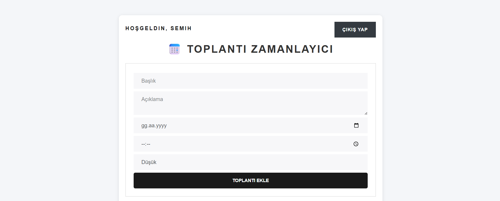
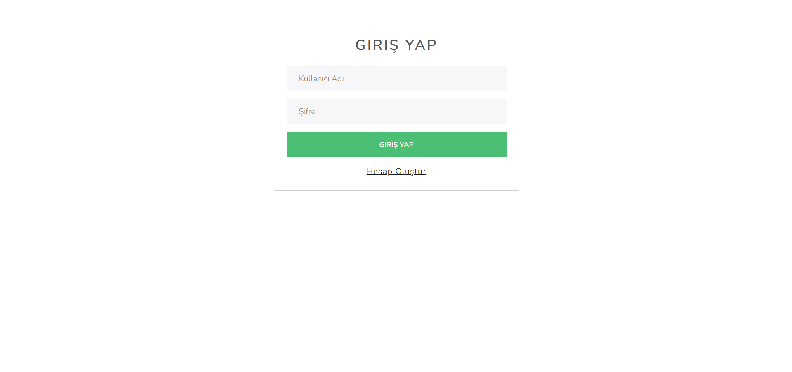
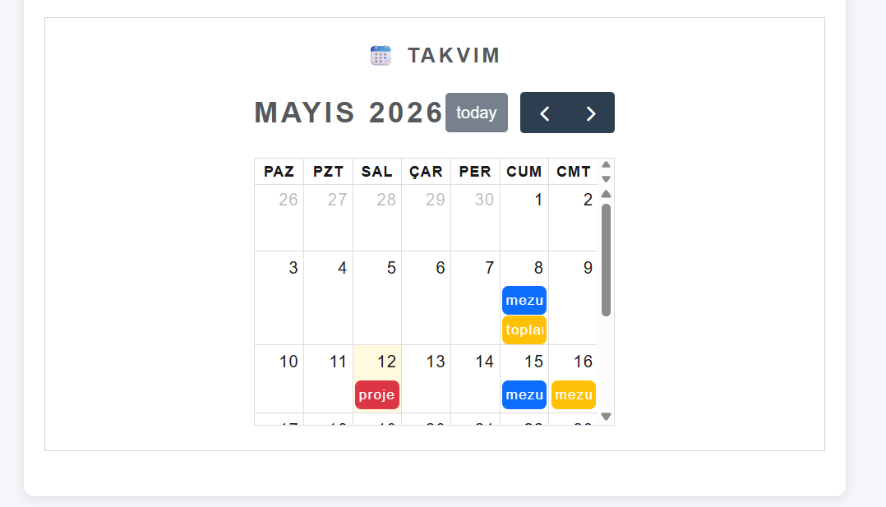

# 📅 Meeting Scheduler

Modern ve kullanıcı dostu bir **Toplantı Zamanlayıcı Sistemi**.  
PHP ve MySQL kullanılarak geliştirildi.

---

## 🚀 Özellikler

✅ Kullanıcı giriş sistemi  
✅ Toplantı ekleme  
✅ Takvim görünümü  
✅ Veritabanına kayıt  
✅ Responsive tasarım  
✅ Bootstrap arayüzü  

---

## 📷 Proje Görselleri

### Ana Sayfa

---

### Giriş Sistemi

---

### Takvim Sistemi

---

### Proje Ortakları

Fatma Nur Köşürgeli, Semih Kurnalı, Atakan Ezer

